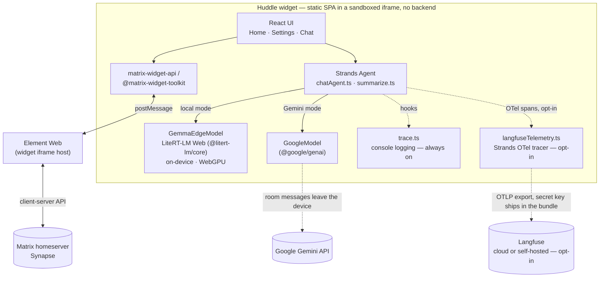

# Huddle

A Matrix widget that summarizes today's messages across
rooms you choose, entirely on-device — no backend, no network call carries
message content anywhere. This design assumes WebGPU is available and
usable from inside a real Element widget iframe (confirmed by hand before
this was built); there's no fallback path for an environment where it
isn't.

(Formerly "Chat Summary" — renamed to Huddle. The `io.github.chatsummary.*`
state event type and other internal identifiers below are unchanged on
purpose; see the PR/commit that did the rename for why.)

## Demo

- [Demo 1](https://github.com/toshanmugaraj/huddle/releases/download/v0.1.0/Demo1.mov)
- [Demo 2](https://github.com/toshanmugaraj/huddle/releases/download/v0.1.0/Demo2.mov)

(Links download/open the `.mov` file rather than playing inline.)

## How it works

- **Settings**: add rooms by ID/alias, pick a Gemma variant, edit the
  summary instruction. Persisted as a state event in the widget's own room
  (`io.github.chatsummary.settings`, state-keyed per user).
- **Home**: hit **Sync** to walk your selected rooms one at a time, gather
  each room's messages from today (see `src/matrix/messages.ts`), and
  summarize them with a Strands `Agent` (`src/agent/summarize.ts`) backed by
  a custom `Model` (`src/model/GemmaEdgeModel.ts`) that runs a quantized
  Gemma model in-browser via Google's LiteRT-LM Web runtime
  (`@litert-lm/core`, WebGPU). Summaries live in an in-memory store
  (`src/state/summaryStore.ts`) — a reload clears them, by design.

## Architecture



- The widget never talks to the homeserver directly — it's an iframe sandboxed by Element, and everything room-related (messages, state events) goes through `matrix-widget-api`'s postMessage bridge to Element, which does the actual Matrix networking. Settings and message reads/writes covered in "How it works" above all flow through this box.
- **Local mode** (default) never leaves the widget box: `GemmaEdgeModel` runs the quantized Gemma weights in-browser via LiteRT-LM Web (`@litert-lm/core`) on WebGPU. **Gemini mode** is the one path that leaves the device (the dashed edge to Google's API), by design and only opt-in (see "Configuring the model in Settings" below).
- **Tracing** is two independent, separately-gated things off the same `Agent`: `trace.ts`'s console logging (always on, no setup) and `langfuseTelemetry.ts`'s OTel export to Langfuse (off unless `VITE_LANGFUSE_*` are set at build time). See "Observability" below for what turning the latter on actually means for a backend-less static SPA.

## Before it'll actually summarize anything

Drop a Gemma `.litertlm` weight file into `public/models/` — see
`public/models/README.md`. **`gemma-4-E2B-it-web.litertlm` is the supported
model for now**, downloadable from
[litert-community/gemma-4-E2B-it-litert-lm on Hugging
Face](https://huggingface.co/litert-community/gemma-4-E2B-it-litert-lm/tree/main).
Without it, "Prepare model" will fail with a 404, cleanly (the UI surfaces
the error; nothing else breaks).

## Running it

```sh
npm install
npm run dev     # https://localhost:5174 (self-signed cert)
```

Same mixed-content/cert caveat as the spike: visit the URL directly first
and click through the certificate warning, *then* add it as a custom
widget in an Element room (Room settings → Widgets → Add a widget →
Custom).

```sh
npm run build   # production bundle, dist/
npm test        # vitest — today's-messages filtering logic covered so far
```

## Configuring the model in Settings

Open the **Settings** tab. Under **Summarization**, pick a mode — **On-device
(private)** or **Gemini API (cloud)** — then follow the steps for that mode
below, and finish with **Save settings** at the bottom.

### On-device (private) — Gemma via LiteRT-LM Web

1. Pick a variant from the dropdown: **Gemma 4 E2B (fast)** or **Gemma 4 E4B
   (quality)**. **Gemma 4 E2B is the supported model for now** — see
   `public/models/README.md` for the other variant's status.
2. Get the weights into the browser, either way:
   - **Bundled**: drop the matching `.litertlm` file into `public/models/`
     before building/running — see "Before it'll actually summarize
     anything" above and `public/models/README.md`. For E2B, that file is
     downloadable from [litert-community/gemma-4-E2B-it-litert-lm on
     Hugging
     Face](https://huggingface.co/litert-community/gemma-4-E2B-it-litert-lm/tree/main).
   - **Per-browser upload**: click **Upload model file** and pick a
     `.litertlm` file from disk. Stored in this browser only (OPFS) — it
     survives a reload but won't follow you to another browser/device, so
     this is a one-time step per installation, not per session.
     **Replace model file** / **Remove** appear once one's stored.
3. Click **Prepare model**. This loads the weights and warms up the
   WebGPU/WASM runtime — expect it to take a while for a multi-GB file. The
   chip next to the button goes Preparing… → Ready, or Failed with the
   error shown underneath.
4. **Save settings**.

Sync (Home tab) and Chat both use whichever variant is currently selected
here — re-run **Prepare model** after switching variants or replacing the
uploaded file, since Chat gates on this same "Ready" status before it'll
let you send anything.

### Gemini API (cloud)

1. Pick a variant from the dropdown: **Gemini 3.6 Flash (fast)** or
   **Gemini 3.7 Flash (quality)**.
2. Get an API key from Google AI Studio (aistudio.google.com) and paste it
   into the **Gemini API key** field.
3. **Save settings**.

Unlike on-device mode, this mode sends the room's messages to Google's
servers to be summarized — Settings shows the same warning inline. The key
is stored only in this browser's `localStorage`, never written to the
Matrix room state and never synced across devices/browsers, so it needs
entering again per browser.

## Observability

`src/agent/trace.ts` always logs Agent lifecycle events (model calls, tool
calls, interrupts) to the console — useful in devtools out of the box, no
setup. Optionally, setting `VITE_LANGFUSE_PUBLIC_KEY` + `VITE_LANGFUSE_SECRET_KEY`
(+ optional `VITE_LANGFUSE_HOST`) before building sends the same events to
[Langfuse](https://langfuse.com/) as well — see `.env.example` and
`src/agent/langfuseTelemetry.ts`'s file comment for what turning this on
actually means for a backend-less static SPA (short version: the secret key
ships in the bundle, so only point it at an instance/project you're fine
with every widget viewer being able to write to).

(No eval harness yet — a prior pass added a standalone Ragas-based one,
pulled back out for now; may come back if/when it's actually needed.)

## Known follow-ups (not yet built)

- **Model-load progress** is an indeterminate spinner, not a real byte
  progress bar — `Engine.create()` doesn't expose one directly for either
  model source (bundled URL or uploaded `Blob`); a real bar means fetching
  the weight file by hand and wrapping it in a `ReadableStream` that reports
  bytes as they pass through, then passing that stream as `model` instead.
- **Theme live-sync** (`main.tsx`'s `ThemeSync`) reads the to-widget
  `theme_change` payload defensively (`name`/`theme` fields) since
  matrix-widget-api's own types only say "arbitrary contents" — verify
  against a real Element session if it doesn't take effect.
- **Mobile Element** is out of scope — WebGPU + a multi-GB local model
  isn't realistic in a mobile webview; there's no feature-detect banner
  for that yet.
- Only the `getTodayMessages` logic has tests so far; the screens and
  `GemmaEdgeModel` don't.
